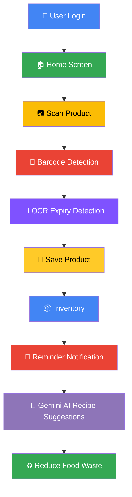

<div align="center">


# 🥗 Expiry Tracker

### *Smart Grocery Expiry Management with AI-Powered Recipe Suggestions*

[](https://developer.android.com)
[](https://kotlinlang.org)
[](https://developer.android.com/jetpack/compose)
[](https://m3.material.io)
[](https://firebase.google.com)
[](https://firebase.google.com/products/firestore)
[](https://firebase.google.com/products/auth)
[](https://developer.android.com/training/camerax)
[](https://developers.google.com/ml-kit)
[](https://ai.google.dev)
[](https://square.github.io/retrofit/)
[](#-tech-stack)
[](https://github.com)
[](#-license)

</div>

---

## 📖 About The Project

Every year, households throw away a staggering amount of food simply because items are forgotten at the back of the fridge or their expiry dates slip through the cracks. This waste isn't just a financial burden — it has a real environmental cost, contributing to unnecessary greenhouse gas emissions and squandering the resources used to produce that food in the first place.

**Expiry Tracker** was built to solve exactly this problem. It gives users a simple, visual way to log every grocery item they bring home, track its expiry date, and get notified before it's too late. Instead of guessing what's about to go bad, users get a clear, organized view of their entire inventory — updated in real time and synced securely to the cloud.

What truly sets Expiry Tracker apart is its integration with **Google Gemini AI**. Rather than letting soon-to-expire ingredients go to waste, the app analyzes what's in your inventory and generates smart, personalized recipe suggestions — helping you cook with what you already have, save money, and meaningfully reduce food waste, one meal at a time.

---

## 🏷 Badges

<div align="center">

`Android` · `Kotlin` · `Jetpack Compose` · `Material 3` · `Firebase` · `Cloud Firestore` · `Firebase Authentication` · `CameraX` · `Google ML Kit` · `Gemini AI` · `Retrofit` · `MVVM`

</div>

---

## ✨ Features

| Feature | Description |
|---|---|
| 📦 **Smart Inventory Management** | Add, edit, and organize grocery items with categories and quantities |
| 📷 **Barcode Scanner** | Instantly scan product barcodes using CameraX for fast entry |
| 📝 **OCR Expiry Date Detection** | Automatically detect printed expiry dates using ML Kit Text Recognition |
| 📅 **Expiry Tracking** | Visual dashboard of items nearing or past their expiry date |
| 🔔 **Reminder Notifications** | Timely alerts before your groceries expire |
| 🤖 **Gemini AI Recipe Suggestions** | Personalized recipes generated from your expiring ingredients |
| 🔥 **Firebase Authentication** | Secure sign-in and account management |
| ☁️ **Cloud Firestore Database** | Real-time, reliable data sync across devices |
| 🖼 **Profile Management** | Personalize your profile and preferences |
| 🌙 **Light / Dark Theme Support** | Seamless theme switching for comfortable viewing |
| ⚡ **Material Design 3 UI** | Clean, modern, mobile-first interface |

---

## 📸 Screenshots

<div align="center">

| Login Screen | Home Screen | Inventory Screen |
|:---:|:---:|:---:|
|  |  |  |

| Barcode Scanner | OCR Expiry Detection | AI Recipe Suggestion |
|:---:|:---:|:---:|
|  |  |  |

| Recipe Details | Profile Screen | Settings Screen |
|:---:|:---:|:---:|
|  |  |  |

</div>

> 💡 *Replace the placeholder paths above with actual screenshots stored in a `/screenshots` folder in your repository.*

---

## 🔄 App Workflow



---

## 🛠 Tech Stack

| Layer | Technologies |
|---|---|
| **Frontend** | Kotlin · Jetpack Compose · Material 3 |
| **Backend** | Firebase Authentication · Cloud Firestore · Firebase Storage |
| **AI** | Google Gemini API |
| **Scanning** | CameraX · ML Kit Barcode Scanner · ML Kit Text Recognition (OCR) |
| **Image Editing** | uCrop |
| **Networking** | Retrofit · Gson |
| **Architecture** | MVVM (Model-View-ViewModel) |
| **Image Loading** | Coil |

---

## 📁 Project Structure

```
app/src/main/java/com/example/expirytracker1/
├── api/
├── auth/
├── data/
├── notifications/
├── repository/
├── scanner/
├── screens/
├── ui.theme/
├── utils/
├── viewmodel/
└── MainActivity.kt
```

---

## 🚀 Installation

<details>
<summary><b>Click to expand installation steps</b></summary>

### Prerequisites
* **Android Studio** Ladybug (or newer)
* **JDK 17** or higher
* A **Firebase Project**
* A **Google Gemini API Key**

---

### Step-by-Step Setup

1. **Clone the repository**
   ```bash
   git clone https://github.com/ayushpatell-prog/Expiry-Tracker-
   cd expiry-tracker
   ```

2. **Open in Android Studio**
   * Launch Android Studio
   * Select `Open an Existing Project`
   * Navigate to the cloned folder

3. **Sync Gradle**
   * Let Android Studio automatically download dependencies
   * If prompted, click `Sync Now`

4. **Add `google-services.json`**
   * Download it from your Firebase Console
   * Place it inside the `app/` directory

5. **Add your Gemini API Key**
   * Create/open `local.properties` in the project root
   * Add your key as shown in Configuration below

6. **Build & Run**
   * Connect an Android device or start an emulator
   * Click `Run` ▶️

</details>

---

## ⚙️ Configuration

<details>
<summary><b>Click to expand configuration details</b></summary>

> ⚠️ **Important:** Never commit API keys or Firebase configuration files to version control.

Add the following to your `local.properties` file:

```properties
GEMINI_API_KEY=YOUR_API_KEY
```

</details>
```

Also make sure to:
- Add `local.properties` and `google-services.json` to your `.gitignore`
- Keep your Gemini API key restricted and rotated periodically
- Avoid embedding sensitive keys directly in client-side code for production builds — consider a secure backend proxy

</details>

---

## 🔮 Future Enhancements

- 🗣 Voice Assistant
- 🛒 Smart Shopping List
- 🥗 Nutrition Information
- 📊 Analytics Dashboard
- ☁️ Cloud Backup
- 🤖 Personalized AI Meal Planner

---

## 👥 Team

| Avatar | Name | Role | GitHub |
|:---:|---|---|---|
|  | Your Name | Android Developer | [@your-username](https://github.com/your-username) |
|  | Contributor Name | UI/UX Designer | [@contributor](https://github.com/contributor) |
|  | Contributor Name | Backend Developer | [@contributor](https://github.com/contributor) |

Contributions are welcome! Feel free to open an issue or submit a pull request. 🎉

---

## 📄 License

This project is licensed under the **MIT License** — see the [LICENSE](LICENSE) file for details.

---

## 🙏 Acknowledgements

- [Android Developers](https://developer.android.com)
- [Jetpack Compose](https://developer.android.com/jetpack/compose)
- [Firebase](https://firebase.google.com)
- [Google ML Kit](https://developers.google.com/ml-kit)
- [Google Gemini AI](https://ai.google.dev)
- [Material Design](https://m3.material.io)

---

<div align="center">

### Made with ❤️ using Kotlin, Jetpack Compose, Firebase & Google Gemini AI

⭐ *If you like this project, don't forget to star it!* ⭐

</div>
